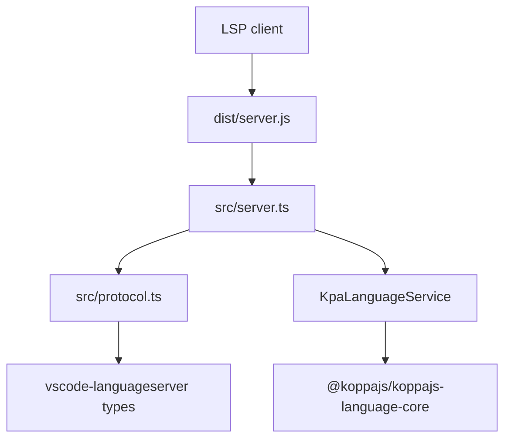

# Architecture

## Repository Classification

- Type: standalone package
- Runtime responsibility: expose KoppaJS semantic language features over LSP
- Build-time responsibility: compile TypeScript, emit declarations, and run the
  local repository quality gates
- UI surface: none
- Maturity: pre-1.0, intentionally narrow

## System Overview

`@koppajs/koppajs-language-server` is a Node-hosted LSP server that translates
`@koppajs/koppajs-language-core` services into LSP requests, responses, and
notifications. The runtime is intentionally thin:

- `src/server.ts` is the only composition root.
- `src/protocol.ts` owns pure mapping between KoppaJS service shapes,
  workspace-root updates, and LSP types.
- `@koppajs/koppajs-language-core` remains the semantic truth for diagnostics,
  completions, navigation, and symbols.

## Runtime Lifecycle

1. The client starts `dist/server.js` as a Node process.
2. `src/server.ts` creates the LSP connection and document store.
3. `initialize` collects file-based workspace roots and advertises the supported
   capabilities.
4. When the client supports dynamic watched-file registration, `initialized`
   registers watchers for `.kpa`, JS/TS, and project-config inputs.
5. When the client supports workspace-folder change notifications, added and
   removed file roots update `KpaLanguageService` and trigger a diagnostics
   refresh for all open documents.
6. Open/change/close events update the language-core overlay state and publish
   diagnostics for the current and affected open documents.
7. Watched-file change notifications invalidate underlying file paths in the
   workspace graph and conservatively refresh open-document diagnostics.
8. Feature requests delegate to `KpaLanguageService` and are mapped into LSP
   shapes by `src/protocol.ts`.

## Module Responsibilities

| Module            | Responsibility                                                                      |
| ----------------- | ----------------------------------------------------------------------------------- |
| `src/server.ts`   | Connection setup, event wiring, diagnostics publication, composition                |
| `src/protocol.ts` | Pure mapping between KoppaJS language-core shapes, workspace roots, and LSP objects |
| `test/*.test.cjs` | Unit tests for the explicit LSP contract mapping and capability surface             |
| `dist/`           | Generated runtime and declaration output used for packaging and execution           |

Additional detail lives in
[docs/architecture/module-boundaries.md](docs/architecture/module-boundaries.md)
and [docs/architecture/runtime-flow.md](docs/architecture/runtime-flow.md).

## Architectural Invariants

- `src/server.ts` is the only runtime composition root.
- Semantic ownership remains in `@koppajs/koppajs-language-core`.
- Protocol mapping functions stay pure and testable in isolation.
- Non-file workspace folders and watched-file URIs are ignored.
- Service-level request failures are translated into LSP `RequestFailed` errors.
- Workspace-folder changes refresh open-document diagnostics after the active
  roots change.
- Diagnostics are currently warning-level only and use the stable source string
  `koppa-diagnostics`.
- Only quick-fix code actions are advertised.

## Build and Test Architecture

- TypeScript compiles the runtime into `dist/`.
- ESLint and Prettier provide the formatting and static-analysis baseline.
- `node:test` covers the protocol mapping layer and targeted stdio-LSP
  integration flows against the built output.
- Manual smoke verification remains necessary for broader editor-client
  interactions beyond the maintained integration harness.

## Known Gaps

- Broader editor-driven LSP interactions such as hover, navigation, rename, and
  quick-fix UX are still validated manually outside the targeted stdio harness.
